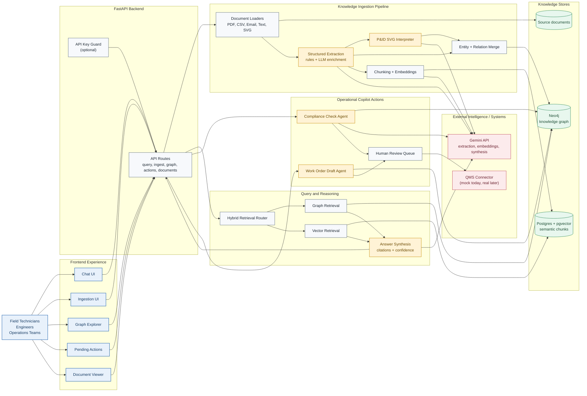

# Clean Architecture Diagram

This version is a simplified, presentation-friendly view of the current system for the **Expert Knowledge Copilot**. It focuses on the main runtime flow: document ingestion, hybrid retrieval, cited answer generation, and human-reviewed operational actions.

## What this diagram emphasizes

- The product is a **RAG-powered industrial copilot**, not just a chatbot.
- Documents are transformed into **two complementary knowledge layers**:
  - a **knowledge graph** in Neo4j for entities, assets, procedures, and relationships
  - a **vector index** in pgvector for semantic search over document chunks
- User questions run through **hybrid retrieval**, then an LLM synthesizes a response with **citations and confidence**.
- Operational outputs such as compliance flags and work-order drafts are **human reviewed before action**.
- The UI supports both **mobile field usage** and **desktop engineering workflows**.
