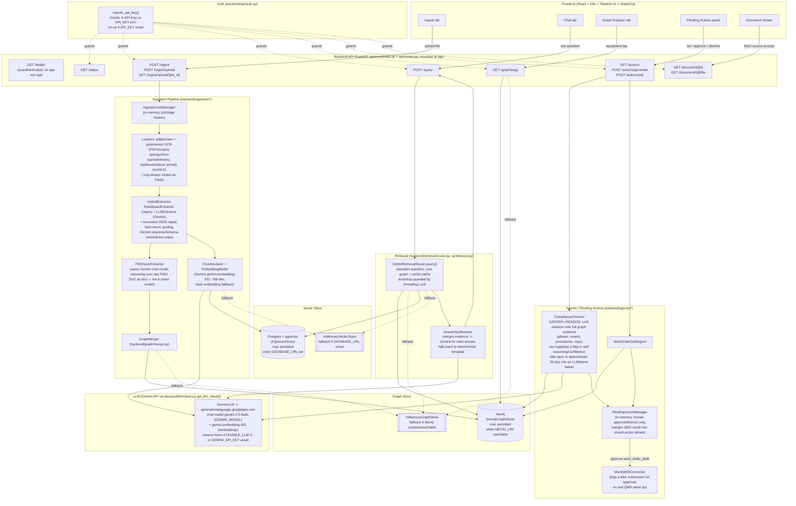

# Architecture

This reflects the code as it exists today (verified by reading source files directly, not README claims). The app is a FastAPI backend with a React/Vite frontend, gated by an optional API-key header, running on the **Gemini API** (no local Ollama model remains): documents are loaded/OCR'd, run through a hybrid regex + Gemini extractor (plus an SVG-as-text extractor for P&ID diagrams), merged into a Neo4j knowledge graph, and chunked/embedded into pgvector via the Gemini embedding model. Queries fan out to both stores, and a Gemini-backed synthesizer produces a cited answer; separate agents propose (never auto-execute) compliance flags and work-order drafts for human approval — the compliance agent now reasons over full graph evidence via the LLM before falling back to a deterministic date-based rule.

## What's real vs. in-memory

- **Neo4j (`Neo4jGraphStore`)** — real and persisted. `backend/retrieval/router.py`'s `_default_graph_store()` uses it only when `NEO4J_URI` is set and the driver's `verify_connectivity()` succeeds; otherwise it silently degrades to `InMemoryGraphStore` (`backend/graph/neo4j_client.py`). In the current `backend/.env`, `NEO4J_URI=bolt://127.0.0.1:7687` is set, so the real Neo4j path is what's actually configured.
- **Postgres + pgvector (`PgVectorStore`)** — real and persisted. Used only when `DATABASE_URL` is set (`backend/retrieval/router.py`); otherwise falls back to `InMemoryVectorStore` (`backend/retrieval/index.py`). `backend/.env` currently sets `DATABASE_URL=postgresql://akash@127.0.0.1:5432/ikb`, so this is the live configuration.
- **`IngestionJobManager`** (`backend/ingestion/jobs.py`) — in-memory and ephemeral. Job/stage status for uploads lives only in process memory and is lost on backend restart, even though the graph/vector writes those jobs trigger ARE persisted.
- **`PendingActionManager`** (`backend/agents/manager.py`) — in-memory and ephemeral. Proposed compliance flags and work-order drafts, and their approve/dismiss status, are not persisted anywhere; a restart clears them. It now also merges the QMS approval result (reference/status) back into the stored action's details, so a later `GET /actions` reflects the approval outcome for as long as the process stays up.
- **`MockQMSConnector`** (`backend/integrations/qms.py`) — explicitly a mock. On work-order approval it just logs a fake payload and returns a synthetic `QMS-MOCK-...` reference; it never calls a real external QMS.
- Both the graph store and the vector store are individually resilient: each degrades independently to its in-memory fallback if its respective env var is missing or the service is unreachable, rather than the API failing outright.

## LLM provider: Gemini API, not local Ollama

The stack no longer runs a local model. `backend/llm/client.py`'s `GeminiLLM` calls `https://generativelanguage.googleapis.com` (configurable via `GEMINI_HOST`), using chat model `gemini-2.5-flash` (`GEMINI_MODEL`) and embedding model `gemini-embedding-001` (`GEMINI_EMBEDDING_MODEL`) for `EmbeddingModel` in `backend/retrieval/index.py` (768-dim via `outputDimensionality`, with a deterministic hash-embedding fallback on failure, missing `GEMINI_API_KEY`, or `DISABLE_LLM=1`). `get_llm_client()` returns `None` — triggering each caller's deterministic fallback — whenever `GEMINI_API_KEY` isn't set, not just when `DISABLE_LLM=1`. This affects extraction (`HybridExtractor`), the P&ID extractor (`PIDVisionExtractor` — reasons over raw SVG **text**, not an image, despite its name), the answer synthesizer, and the compliance agent's reasoning pass. Structured JSON output is enforced via Gemini's `responseSchema` (an OpenAPI 3.0 subset with no `$ref`/`$defs` support), so `backend/llm/client.py` inlines Pydantic's `model_json_schema()` output before sending it.

## New since the last revision

- **API-key auth** (`backend/api/auth.py`): `require_api_key()` checks an `X-API-Key` header against the `API_KEY` env var and is wired as a dependency across the entire `/api` router. It's a no-op (auth effectively disabled) when `API_KEY` is unset, which is the current default. `GET /health` is declared directly on the app (not under `/api`) and stays unauthenticated.
- **New routes**: `GET /status` (readiness probe), `POST /ingest` (direct JSON payload ingestion alongside the existing `POST /ingest/upload`), and `GET /document/{id}/file` (raw file download alongside the existing metadata endpoint).
- **Smarter compliance agent**: `ComplianceChecker` now runs a GATHER→REASON loop — it still starts from the deterministic 30-days-since-last-inspection rule, but when an LLM client is available it reasons over full graph evidence (aliases, events, procedures, regulatory references) and can either suppress a flag the old rule would have raised or return a richer proposal with `reasoning`, `agent_confidence`, and `reasoning_mode`. Any LLM or parse failure falls back silently to the original deterministic proposal.
- **Retrieval router hardening**: `HybridRetrievalRouter`'s store bootstrap is now guarded by a `threading.Lock` to prevent concurrent double-bootstrap races; fallback behavior to in-memory stores is otherwise unchanged.
- **LLM output robustness in extraction**: `HybridExtractor` (`backend/ingestion/extract.py`) adds `_repair_truncated_json` (recovers truncated model output) and `_quote_bare_enum_values` (patches unquoted enum literals the model sometimes emits), on top of the `responseSchema` constraint, since neither guarantee is airtight in practice.
