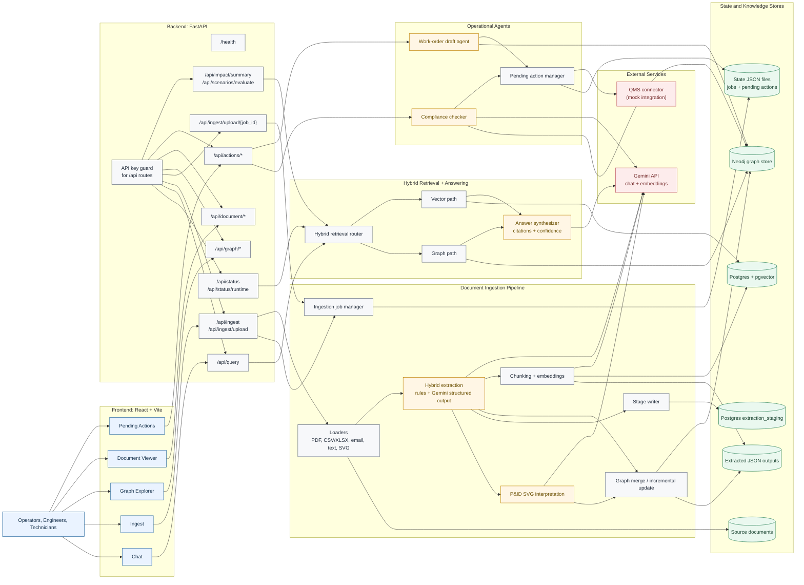

# Project Architecture

This diagram reflects the current code in `industrial-knowledge-brain` as of July 22, 2026.

## Notes

- The frontend is a single React app with dedicated pages for chat, ingestion, graph exploration, document viewing, and pending actions.
- FastAPI exposes the API, with `/health` left open and `/api/*` protected by the optional API-key dependency.
- Ingestion creates two knowledge layers: a graph in Neo4j and vector chunks in Postgres/pgvector.
- Query answering uses both retrieval paths, then synthesizes a cited answer with confidence and follow-up actions.
- Jobs and pending actions are persisted in JSON state files under `backend/data/state`, while extraction staging is optionally written to Postgres.
